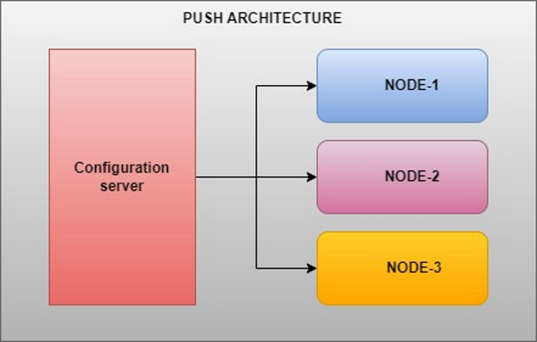

# Introduction to Ansible
## What is Ansible ?
Ansible is an open source IT automation engine that automates

provisioning
configuration management
application deployment
orchestration
and many other IT processes. It is free to use, and the project benefits from the experience and intelligence of its thousands of contributors.

## How Ansible works ?
Ansible is agentless in nature, which means you don't need install any software on the manage nodes.

For automating Linux and Windows, Ansible connects to managed nodes and pushes out small programs—called Ansible modules—to them. These programs are written to be resource models of the desired state of the system. Ansible then executes these modules (over SSH by default), and removes them when finished. These modules are designed to be idempotent when possible, so that they only make changes to a system when necessary.

For automating network devices and other IT appliances where modules cannot be executed, Ansible runs on the control node. Since Ansible is agentless, it can still communicate with devices without requiring an application or service to be installed on the managed node.

# Comparison with Shell Scripting
- Shell Scripting works only for Linux.
- Becomes complex and less readable(for non-experts) as the script size goes high.
- Idempotence and predictability

When the system is in the state your playbook describes Ansible does not change anything, even if the playbook runs multiple times.

for example, run the below shell script twice and you will notice the script will fail. Which means shell scripting is not idempotent in nature.

```sh
#/bin/bash

set -e 

mkdir test-demo
echo "hi"

```
- Scalability and flexibility
Easily and quickly scale the systems you automate through a modular design that supports a large range of operating systems, cloud platforms, and network devices.


